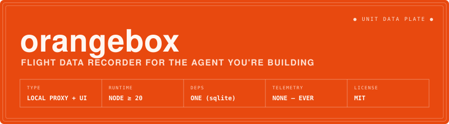
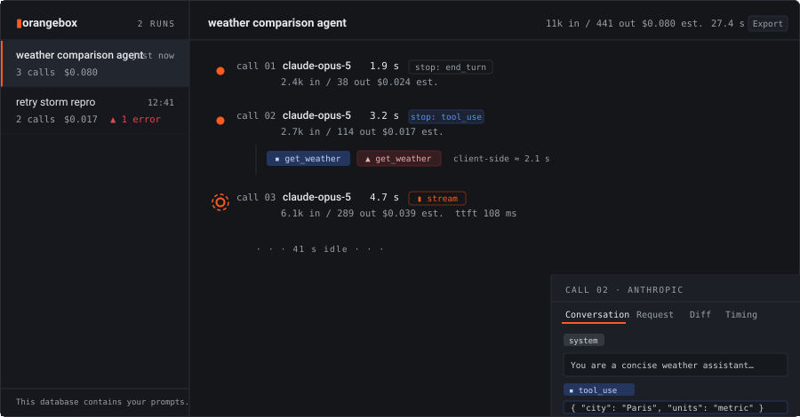
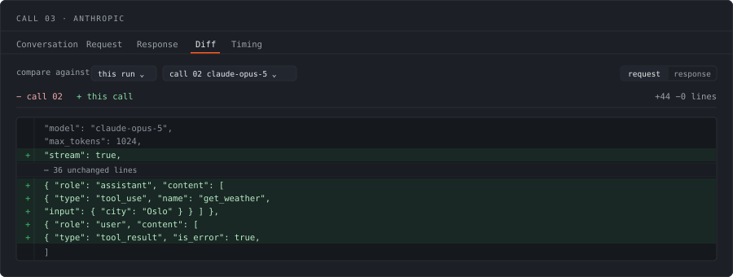
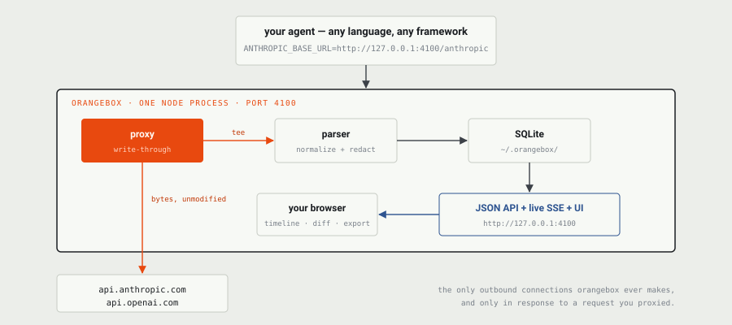

<p align="center">
  
</p>

<p align="center">
  <a href="https://orangebox-website.vercel.app/"><b>Website</b></a> ·
  <a href="#quickstart">Quickstart</a> ·
  <a href="#who-this-is-for">Who it's for</a> ·
  <a href="#how-it-works">How it works</a>
</p>

<p align="center">
  <a href="https://github.com/EzraStone/orangebox/releases"></a>
  <a href="https://github.com/EzraStone/orangebox/actions/workflows/ci.yml"></a>
  
  
  
  <a href="LICENSE"></a>
</p>

Point your agent at a local port and press play. orangebox records every LLM API call **your own agent code** makes — the exact prompt, the tool calls, the stream, the retries, the tokens, the cost — into one SQLite file on your machine, and draws each run as a timeline you can inspect, diff, and export.

*Aircraft black boxes are painted international orange so they can be found. Same idea: when your agent crashes, the evidence should survive.*

<!-- §18.1 asks for a screen-capture GIF above the fold. This is an animated SVG
     standing in: it loops, weighs 11 KB instead of 15 MB, stays diffable in git,
     and falls back to a still frame under prefers-reduced-motion. -->

<p align="center">
  
</p>

---

## Quickstart

Needs **Node 20 or newer**. Nothing to sign up for, nothing to configure.

The easiest path lets orangebox set the provider URLs and create a precise run boundary for you:

```bash
npx orangebox-ai run --name "checkout bot" -- node agent.js
```

The UI opens at <http://127.0.0.1:4100> and calls appear immediately, including in-flight streaming calls. Install it globally if you use it every day:

```bash
npm install --global orangebox-ai
orangebox run --name "checkout bot" -- node agent.js
```

To monitor a run from a phone on the same trusted network, start the preview mobile mode:

```bash
npx orangebox-ai --mobile
```

Open the printed LAN pairing link on the phone or enter its one-time code. The phone receives a revocable, read-only session: it can inspect live runs and exports, but cannot replay, edit, delete, clear, or proxy model traffic. Use the **M** control in the desktop UI to rotate the code or revoke a device. Pairing sessions expire after 30 days and all disappear when orangebox restarts.

Mobile mode is an early preview. Its LAN URL currently uses HTTP, so traffic is not encrypted and install/notification support depends on the browser's secure-context rules. Use it only on a private network you trust; HTTPS onboarding is the next mobile milestone.

To point an already-running process at orangebox, start the recorder with `npx orangebox-ai`, then set the base URL for your shell:

| Shell | Commands |
| --- | --- |
| Bash / zsh | `export ANTHROPIC_BASE_URL="http://127.0.0.1:4100/anthropic"`<br>`export OPENAI_BASE_URL="http://127.0.0.1:4100/openai"` |
| PowerShell | `$env:ANTHROPIC_BASE_URL="http://127.0.0.1:4100/anthropic"`<br>`$env:OPENAI_BASE_URL="http://127.0.0.1:4100/openai"` |
| cmd.exe | `set ANTHROPIC_BASE_URL=http://127.0.0.1:4100/anthropic`<br>`set OPENAI_BASE_URL=http://127.0.0.1:4100/openai` |

## Who this is for

**orangebox records the agent you are building, not the agent CLI you are using.**

If you are writing agent code yourself — against the Anthropic or OpenAI SDK, or on top of a framework like LangGraph — orangebox records that traffic. It sits at the HTTP layer, so it does not care which client library, language, or framework you chose, and there is nothing for it to fall behind on when you switch.

If instead you want to inspect what an off-the-shelf coding-agent CLI is doing — Claude Code, Codex CLI, Gemini CLI, Cursor CLI and friends — a tool purpose-built for those, like [claude-tap](https://github.com/liaohch3/claude-tap), is the better fit: it knows those specific tools, auto-detects their auth, and needs no configuration at all. orangebox is deliberately not competing for that job.

Same mechanism, different target. Pick the one aimed at your problem.

## Why

- **Zero code changes.** One environment variable, or none at all with `orangebox run`. Nothing to instrument, nothing to forget.
- **Fully local. No account, no telemetry, no cloud.** Your prompts go into one SQLite file on your machine and nowhere else. The process makes no network calls except forwarding yours upstream.
- **Works with any language or framework.** It's just HTTP — Python, JS, Go, curl, LangChain, whatever. orangebox sits at the wire, so it cannot be bypassed by a client library it has never heard of.

## What you get

**A timeline of the whole run.** Every call in order, with latency, token counts, stop reason, and estimated cost. A 40-second tool gap or a 3× retry storm is visible without reading anything.

<p align="center">
  
</p>

**The exact prompt the model saw.** Click any call and read the full message history at that moment — system prompt, every turn, tool results injected — as the model received it, not as you think you assembled it.

**Tool calls, paired.** `tool_use` blocks and the `tool_result` that answered them, linked, with errors flagged. The wall-clock gap between calls is labelled "client-side ≈" because orangebox sees the result, not the execution.

**Diffing, because prompts drift.** Any call can be diffed against another — the previous call in the run by default, or any call in any other run. Line-level, with long unchanged stretches collapsed, so "what changed in the prompt between turn 4 and turn 5?" is one click instead of an eyeball comparison of two 6,000-line payloads. Works on the request or the response.

<p align="center">
  
</p>

**Streaming, faithfully.** Chunks are relayed the instant they arrive — the recorder adds no measurable latency — then the captured transcript is folded back into a normal response object so a streamed call reads exactly like a non-streamed one. Time-to-first-token is recorded per call.

**Cost, labelled honestly.** Token counts × the rates in `src/pricing.json`. Always shown as "est.", never as billing truth. Unpriced model or missing counts? You get an em-dash and a tooltip saying which, not a confident $0.00.

**Replay and edit.** Open a call, choose **Replay & edit**, change the prompt, model, tools, or parameters, and orangebox sends it again in a new run. The original and replay are automatically aligned so output, latency, token, cost, model, error, prompt, and tool changes are visible together.

Replay reads the key from the environment orangebox itself runs in, per provider:

| Provider | Variables checked, in order |
| --- | --- |
| `anthropic` | `ANTHROPIC_API_KEY` |
| `openai` | `OPENAI_API_KEY` |
| `gemini` | `GEMINI_API_KEY`, `GOOGLE_API_KEY` |
| `bedrock` | `AWS_BEARER_TOKEN_BEDROCK`, `BEDROCK_API_KEY` |
| `ollama` | none — local inference has nothing to authenticate against |

Credentials are never recovered from a recording, because orangebox deliberately
does not store them. If the variable is unset, replay refuses up front and names
the one to set rather than sending an unauthenticated request and handing you the
provider's 401. That check applies only when the provider still points at its own
cloud endpoint; if you have overridden the upstream, orangebox forwards and lets
that endpoint decide what it wants.

**Whole-run comparison.** Compare any two runs call by call. Missing calls and regressions are explicit instead of being buried in two timelines.

**Find old evidence.** Search run names and tags; filter by model, provider, tool, error state, minimum latency, minimum cost, or date; rename and tag runs; and page through the complete history.

**Share without shipping the database.** **Share** previews a self-contained sanitized HTML report that redacts system prompts, tool payloads, emails, IDs, credential-shaped values, and secrets; save that page to share it. JSON and OpenTelemetry exports remain available for machine workflows.

**OpenAI Responses API.** Chat Completions and Responses are both parsed, including semantic streaming events, function calls and outputs, usage, cached tokens, partial streams, and first-token timing.

<!-- §18.1 asks for one screenshot per feature. The figures above cover the
     timeline, the detail drawer, and the diff; real screen captures should
     replace them once there is a run worth photographing. -->

## How it works

<p align="center">
  
</p>

One process, one port. Requests are proxied through untouched and teed to a parser that writes a normalized record to `~/.orangebox/orangebox.db`. The same port serves the UI, a JSON API, and a live SSE feed so the timeline updates while your agent is still running.

Recording happens **after** your client's response is finished — never in the hot path. Measured against a local mock, on one machine:

| Metric | Measured | Budget |
| --- | --- | --- |
| Added latency, non-streamed call | 0.73 ms p50 | < 5 ms |
| 50 concurrent streams, event-loop lag | 31 ms max | < 50 ms |
| Request → recorded | 3 ms p50 | < 150 ms |
| UI open, 1000-call run | 11 ms | < 500 ms |

## CLI

| Command | What it does |
| --- | --- |
| `orangebox` | Start recording (default command). |
| `orangebox run [--name "…"] -- CMD` | Run `CMD` with `ANTHROPIC_BASE_URL`/`OPENAI_BASE_URL` pointed at a run-scoped prefix, so its calls group exactly. Exits with the child's exit code. |
| `orangebox export <run-id> [-o file]` | Write a self-contained JSON file of the run — commit it to a bug report. |
| `orangebox assert <run-id> [limits]` | Exit non-zero when cost, latency, errors, call count, or unknown costs exceed a CI threshold. |
| `orangebox spend [--group <k>]` | What your agents have cost, by model, provider, run, or day — with an explicit count of what it could not price. |
| `orangebox tools [--sort]` | Which tools your agent leans on, which fail, and which never got an answer. |
| `orangebox doctor` | Show what orangebox actually resolved: providers, upstreams, credentials, database, pricing coverage. Exits non-zero on a failure. |
| `orangebox clear [--yes]` | Delete all recorded data. |

| Flag | Default | Behavior |
| --- | --- | --- |
| `--port <n>` | `4100` | Listen port. |
| `--db <path>` | `~/.orangebox/orangebox.db` | Database location; parent dirs are created. |
| `--host <addr>` | `127.0.0.1` | Bind address. Non-loopback use requires authentication or an explicit unsafe override. |
| `--gap <seconds>` | `120` | Idle gap that starts a new implicit run. |
| `--retain <days>` | `0` (forever) | On start, delete runs older than N days. |
| `--openai-upstream <url>` | `https://api.openai.com` | Use Azure OpenAI, OpenRouter, Ollama, vLLM, or another OpenAI-compatible endpoint. |
| `--anthropic-upstream <url>` | `https://api.anthropic.com` | Use an Anthropic-compatible endpoint. |
| `--auth-token <token>` | — | Require `x-orangebox-auth`; use this for non-loopback binding. |
| `--mobile` | — | Bind to the LAN and enable revocable, read-only mobile pairing. |
| `--unsafe-no-auth` | — | Explicitly allow an unauthenticated non-loopback bind. |
| `--no-open` | — | Don't open the browser. |

Two upstreams are configured by environment rather than by flag, because the
variables already exist and nobody should have to learn a second name for them:

| Variable | Default | Behavior |
| --- | --- | --- |
| `OLLAMA_HOST` | `http://127.0.0.1:11434` | Where `/ollama/…` is proxied. Accepts a bare `host:port`. |
| `AWS_REGION` (or `AWS_DEFAULT_REGION`) | `us-east-1` | Picks the `bedrock-runtime.<region>.amazonaws.com` endpoint for `/bedrock/…`. |


CI example:

```bash
orangebox assert "$RUN_ID" --max-cost 0.25 --max-latency 5000 --max-errors 0 --max-calls 12 --require-known-cost
```

## Grouping calls into runs

Every call belongs to exactly one run, resolved in this order:

1. **Path-scoped** — traffic through `/r/<run-id>/anthropic/…`. This is what `orangebox run` sets up.
2. **Header** — send `x-orangebox-run-id: <id>`; both SDKs let you set default headers.
3. **Idle gap** — otherwise, calls within `--gap` seconds of each other land in the same run.

The gap heuristic is deliberately simple. Two unrelated agents running at once will interleave into one implicit run; if that matters, use one of the explicit mechanisms above.

## Spend

`/spend` in the UI, or in a terminal:

```bash
orangebox spend --group model
```

```
  spend by model (all time)

  claude-opus-5                       ##################################     $0.367+     10 calls  (2 no usage)
  claude-sonnet-5                     ######################                  $0.238      4 calls
  gemini-3.1-pro                      ####################                    $0.218      6 calls
  gpt-5.4                             ###################                     $0.207      6 calls
  us.anthropic.claude-sonnet-4-5-20…  #################                       $0.178      5 calls
  claude-haiku-4-5                    ###                                     $0.029      5 calls
  gpt-5-mini                          #                                       $0.016      6 calls
  llama3.2                                                                        $0      4 calls
  some-finetune-2026                                                             $0+      3 calls  (3 unrated)
  us.amazon.nova-pro-v1:0                                                        $0+      3 calls  (3 unrated)

  total $1.25+ across 52 call(s)
  covers 85% of calls — 8 of 52 added nothing, so the real figure is higher.
  6 have no rate for their model — add them to ~/.orangebox/pricing.json.
  2 reported no token counts (errored, aborted, or streamed without usage); their cost is unknowable.
```

Group by `model`, `provider`, `run`, or `day`; window with `--days`, `--since`,
`--until`; emit `--csv` or `--json`.

In the UI, clicking a row filters the runs list down to the calls behind it, so
"opus cost the most" leads somewhere instead of stopping there.

The `+` and the coverage lines are the point. orangebox prices a call by looking
its model up in `pricing.json`, and a model that is not there costs *null*, not
zero. Summing that column naively gives a total that is confidently too low with
nothing on screen to say so.

The shortfall is reported by cause, because the remedies are opposite. An
**unrated** call has tokens but no rate — adding one to `pricing.json` fixes it.
A **no usage** call never reported token counts at all (it errored, the client
hung up, or it streamed without `include_usage`), so its cost is unknowable and
no edit to that file will help. Meanwhile `llama3.2` at a true `$0` stays
visibly distinct from both.

## Tools

`/tools` in the UI, or `orangebox tools`:

```
  tool           uses   errors        avg    slowest

  read_logs         3        0     153 ms     163 ms  (3 unanswered, timed on 2/3)

  3 tool call(s), 0 errored, 3 never answered
```

Two columns need explaining, and both are about not overstating what a proxy
can see.

**Unanswered** is a tool call the model made that never got a result back — a
broken agent loop, a crash, or a run that ended mid-turn. It is invisible on a
timeline unless you go hunting for the missing half, and it is usually the
interesting thing.

**Timing** is the wall-clock hole between two consecutive calls, because
orangebox never watches a tool execute — it sees the request go out and the
result come back. When one call requests three tools, that hole covers all
three and cannot honestly be split, so only single-tool calls contribute to the
average. `timed on 2/3` says how much of the number is real. A tool only ever
used alongside others reports an em-dash rather than a plausible figure.

## Checking your setup

```bash
orangebox doctor
```

```
  ok    orangebox              v1.2.1 on win32
  ok    node                   v24.15.0
  ok    database               ~/.orangebox/orangebox.db — 9 run(s), 281.0 KB, schema v2
  note  provider anthropic     api.anthropic.com — recording works; replay needs ANTHROPIC_API_KEY
  ok    provider ollama        127.0.0.1:11434 — no key needed
  note  provider gemini        generativelanguage.googleapis.com — recording works; replay needs GEMINI_API_KEY or GOOGLE_API_KEY
  ok    pricing table          56 model rates
  note  unpriced models        6 recorded call(s) have no rate: some-finetune-2026, us.amazon.nova-pro-v1:0
```

A `note` is informational — recording works without a key, only replay needs
one. A `FAIL` means something cannot work at all, and the command exits 1 so a
setup script can stop on it. `--json` emits the same report for tooling.

This exists because 1.2.0 shipped three providers pointed at nothing, and
nothing in the product said so. Credentials are reported by variable name; the
values never appear.

## Pricing

Rates live in [`src/pricing.json`](src/pricing.json), matched by the longest key that prefixes the model string — so `claude-haiku-4-5-20251001` resolves through `claude-haiku-4-5`. Prices drift. Drop a corrected file at `~/.orangebox/pricing.json` and orangebox deep-merges it over the shipped one at boot, no upgrade needed:

```json
{ "claude-opus-5": { "in": 5.00, "out": 25.00, "cache_read": 0.50, "cache_write": 6.25 } }
```

## Privacy, plainly

**The database contains your prompts. So do its exports.** That is the whole product — treat both accordingly.

What orangebox does *not* store: API keys. Request headers are reduced to an allowlist (`content-type`, `anthropic-version`, `user-agent`) before anything is written, and any header whose name looks like a credential is dropped regardless. Keys live in process memory only for the duration of the upstream request and never reach the database, the logs, an export, or the UI.

Bind address is `127.0.0.1` by default. Browser mutations require same-origin requests, JSON, and a per-start CSRF token. A non-loopback `--host` is refused unless you provide `--auth-token`, enable read-only `--mobile` pairing, or deliberately opt into `--unsafe-no-auth`.

`--mobile` exposes recorded data to explicitly paired devices on your LAN. Pairing codes carry 120 bits of randomness, attempts are rate-limited, session tokens are hashed in memory, and cookies are HttpOnly with `SameSite=Strict`. Mobile sessions can only make read requests to the orangebox API. The current preview does not encrypt LAN traffic, so do not use it on public, shared, or otherwise untrusted networks.

Outbound connections go only to the configured provider upstreams and only for traffic you proxy or explicitly replay. There are no version checks, telemetry calls, or analytics.

## FAQ

**Which providers?** Five natively: Anthropic Messages, OpenAI (Chat Completions and Responses), Google Gemini, Ollama, and Amazon Bedrock. `--openai-upstream` also covers OpenAI-compatible gateways and local runtimes without any provider-specific code.

Bedrock has one constraint worth knowing before you try it: SigV4 signs the `Host` header, and orangebox strips `Host` like any reverse proxy, so a SigV4-signed request cannot survive the hop. Use a Bedrock API key (bearer auth) and it behaves like the others. orangebox will not hold your AWS credentials in order to re-sign on your behalf.

**Where's my data?** One SQLite file, `~/.orangebox/orangebox.db` (override with `--db`). Delete it and it's gone.

**Does it slow my agent down?** Under 5 ms p50 added latency on a non-streamed call, and effectively zero per chunk on a streamed one — chunks are written through the moment they arrive, and parsing and database writes happen after your client's response has completed.

**Does it work with `<my framework>`?** If it speaks HTTP to one of the two supported APIs, yes. That's the point of doing this at the proxy layer instead of as an SDK wrapper.

**How is this different from claude-tap?** Different target, same good idea. [claude-tap](https://github.com/liaohch3/claude-tap) records off-the-shelf coding-agent CLIs and knows how each one authenticates; orangebox records agent code you wrote yourself and knows nothing about your stack beyond the two HTTP APIs. If you want to see inside Claude Code, use claude-tap. If you want to see inside the thing you are building, use this. See [Who this is for](#who-this-is-for).

**Why not just use Langfuse / Helicone / LiteLLM?** Those are built for teams running agents in production — dashboards, evals, prompt versioning, multi-provider routing, and an account. orangebox is for one developer debugging on one machine, with no account and no data leaving it. Different job; graduate to one of those when you need it.

**What happens if orangebox breaks?** Recording failures are logged and swallowed; your request still goes through. A recorder that takes down the thing it records is worse than no recorder.

**Why "orangebox"?** Aircraft "black boxes" are painted international orange so they can be found. Same idea: when your agent crashes, the evidence should survive — and be easy to spot.

## Roadmap

- [x] **Call diffing** — compare any two calls, in the same run or across runs
- [x] **Replay** — re-send any recorded call, optionally with an edited prompt or a different model, and diff the outputs
- [x] **Run diffing** — side-by-side timelines of two whole runs, aligned call by call
- [x] **OpenAI Responses** — semantic stream events, tools, usage, and partial responses
- [x] **Configurable upstreams** — Azure OpenAI, OpenRouter, Ollama, vLLM, and compatible gateways
- [x] **Native providers** — Anthropic, OpenAI, Gemini, Ollama, and Bedrock, each with its own wire format (SSE, NDJSON, and AWS event-stream)
- [x] **OpenTelemetry export** — GenAI semantic attributes for teams that already have tracing
- [x] **Search, filters, rename, and tags** — navigate a large local history
- [x] **Sanitized HTML sharing** — portable reports with configurable redaction
- [x] **Cost dashboard** — spend by model, provider, run, or day, in the UI and the CLI, with unpriced calls counted rather than hidden
- [x] **Assertions** — fail CI when a run exceeds a cost, latency, error, or loop-count threshold
- [x] **Mobile preview** — responsive installable shell plus read-only LAN pairing, live monitoring, and session revocation
- [ ] **Encrypted mobile onboarding** — local HTTPS and QR pairing without weakening the local-first security model
- [ ] **Provider-native replay credentials UI** — choose stored credential aliases without putting secrets in the database

## Contributing

See [CONTRIBUTING.md](CONTRIBUTING.md) for manual probes and the layout of the codebase. The full build specification this was written from is [`orangebox-spec.html`](orangebox-spec.html), also published [on the website](https://orangebox-website.vercel.app/spec.html).

The landing page lives in its own repo: [EzraStone/orangebox-Website](https://github.com/EzraStone/orangebox-Website).

Requires Node 20 or newer. One runtime dependency: `better-sqlite3`.

```bash
npm install
npm test        # no network access; every upstream is a local mock
```

## License

MIT
