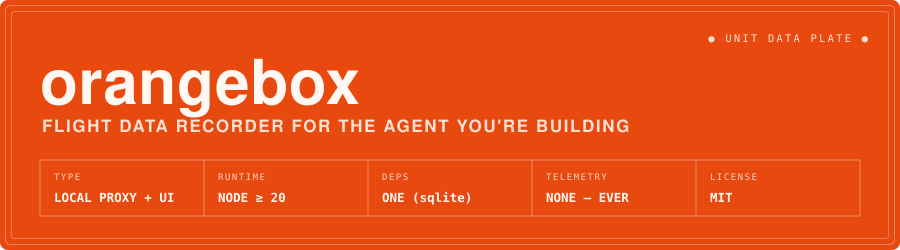
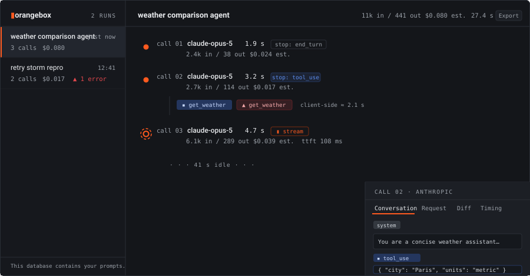
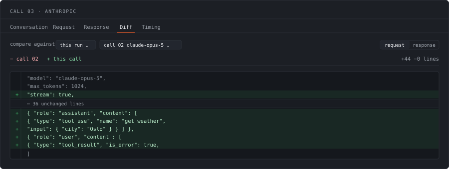
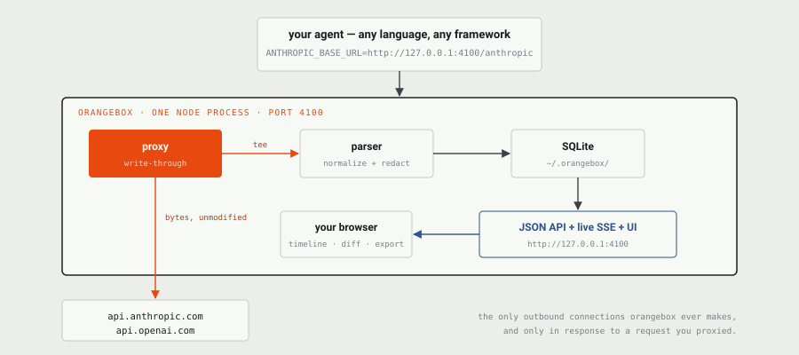

<p align="center">
  
</p>

<p align="center">
  <a href="https://orangebox-website.vercel.app/"><b>Website</b></a> ·
  <a href="#quickstart">Quickstart</a> ·
  <a href="#who-this-is-for">Who it's for</a> ·
  <a href="#how-it-works">How it works</a>
</p>

<p align="center">
  <a href="https://github.com/EzraStone/orangebox/releases"></a>
  <a href="https://github.com/EzraStone/orangebox/actions/workflows/ci.yml"></a>
  
  
  
  <a href="LICENSE"></a>
</p>

Point your agent at a local port and press play. orangebox records every LLM API call **your own agent code** makes — the exact prompt, the tool calls, the stream, the retries, the tokens, the cost — into one SQLite file on your machine, and draws each run as a timeline you can inspect, diff, and export.

*Aircraft black boxes are painted international orange so they can be found. Same idea: when your agent crashes, the evidence should survive.*

<!-- §18.1 asks for a screen-capture GIF above the fold. This is an animated SVG
     standing in: it loops, weighs 11 KB instead of 15 MB, stays diffable in git,
     and falls back to a still frame under prefers-reduced-motion. -->

<p align="center">
  
</p>

---

## Quickstart

Needs **Node 20 or newer**. Nothing to sign up for, nothing to configure.

The easiest path lets orangebox set the provider URLs and create a precise run boundary for you:

```bash
npx orangebox-ai run --name "checkout bot" -- node agent.js
```

The UI opens at <http://127.0.0.1:4100> and calls appear immediately, including in-flight streaming calls. Install it globally if you use it every day:

```bash
npm install --global orangebox-ai
orangebox run --name "checkout bot" -- node agent.js
```

To monitor a run from a phone on the same trusted network, start the preview mobile mode:

```bash
npx orangebox-ai --mobile
```

Open the printed LAN pairing link on the phone or enter its one-time code. The phone receives a revocable, read-only session: it can inspect live runs and exports, but cannot replay, edit, delete, clear, or proxy model traffic. Use the **M** control in the desktop UI to rotate the code or revoke a device. Pairing sessions expire after 30 days and all disappear when orangebox restarts.

Mobile mode pairs a phone to your recorder over the LAN, read-only and revocable.
Add `--https` and the traffic is encrypted and the browser treats the page as a
secure context, which is what install prompts and notifications require.

The certificate is self-signed and nothing trusts it — no public CA will issue
for `192.168.1.x`. Your browser will warn once per device. orangebox prints the
certificate fingerprint so you can check the thing you are accepting is the
thing it generated, and reuses the same certificate between runs so you are not
trained to click through a fresh warning every morning.

Without `--https` the LAN traffic is unencrypted, and orangebox now says so in
the banner rather than only here.

To point an already-running process at orangebox, start the recorder with `npx orangebox-ai`, then set the base URL for your shell:

| Shell | Commands |
| --- | --- |
| Bash / zsh | `export ANTHROPIC_BASE_URL="http://127.0.0.1:4100/anthropic"`<br>`export OPENAI_BASE_URL="http://127.0.0.1:4100/openai"` |
| PowerShell | `$env:ANTHROPIC_BASE_URL="http://127.0.0.1:4100/anthropic"`<br>`$env:OPENAI_BASE_URL="http://127.0.0.1:4100/openai"` |
| cmd.exe | `set ANTHROPIC_BASE_URL=http://127.0.0.1:4100/anthropic`<br>`set OPENAI_BASE_URL=http://127.0.0.1:4100/openai` |

## Who this is for

**orangebox records the agent you are building, not the agent CLI you are using.**

If you are writing agent code yourself — against the Anthropic or OpenAI SDK, or on top of a framework like LangGraph — orangebox records that traffic. It sits at the HTTP layer, so it does not care which client library, language, or framework you chose, and there is nothing for it to fall behind on when you switch.

If instead you want to inspect what an off-the-shelf coding-agent CLI is doing — Claude Code, Codex CLI, Gemini CLI, Cursor CLI and friends — a tool purpose-built for those, like [claude-tap](https://github.com/liaohch3/claude-tap), is the better fit: it knows those specific tools, auto-detects their auth, and needs no configuration at all. orangebox is deliberately not competing for that job.

Same mechanism, different target. Pick the one aimed at your problem.

## Why

- **Zero code changes.** One environment variable, or none at all with `orangebox run`. Nothing to instrument, nothing to forget.
- **Fully local. No account, no telemetry, no cloud.** Your prompts go into one SQLite file on your machine and nowhere else. The process makes no network calls except forwarding yours upstream.
- **Works with any language or framework.** It's just HTTP — Python, JS, Go, curl, LangChain, whatever. orangebox sits at the wire, so it cannot be bypassed by a client library it has never heard of.

## What you get

**A timeline of the whole run.** Every call in order, with latency, token counts, stop reason, and estimated cost. A 40-second tool gap or a 3× retry storm is visible without reading anything.

<p align="center">
  
</p>

**The exact prompt the model saw.** Click any call and read the full message history at that moment — system prompt, every turn, tool results injected — as the model received it, not as you think you assembled it.

**Tool calls, paired.** `tool_use` blocks and the `tool_result` that answered them, linked, with errors flagged. The wall-clock gap between calls is labelled "client-side ≈" because orangebox sees the result, not the execution.

**Diffing, because prompts drift.** Any call can be diffed against another — the previous call in the run by default, or any call in any other run. Line-level, with long unchanged stretches collapsed, so "what changed in the prompt between turn 4 and turn 5?" is one click instead of an eyeball comparison of two 6,000-line payloads. Works on the request or the response.

<p align="center">
  
</p>

**Streaming, faithfully.** Chunks are relayed the instant they arrive — the recorder adds no measurable latency — then the captured transcript is folded back into a normal response object so a streamed call reads exactly like a non-streamed one. Time-to-first-token is recorded per call.

**Cost, labelled honestly.** Token counts × the rates in `src/pricing.json`. Always shown as "est.", never as billing truth. Unpriced model or missing counts? You get an em-dash and a tooltip saying which, not a confident $0.00.

**Replay and edit.** Open a call, choose **Replay & edit**, change the prompt, model, tools, or parameters, and orangebox sends it again in a new run. The original and replay are automatically aligned so output, latency, token, cost, model, error, prompt, and tool changes are visible together.

Replay reads the key from the environment orangebox itself runs in, per provider:

| Provider | Variables checked, in order |
| --- | --- |
| `anthropic` | `ANTHROPIC_API_KEY` |
| `openai` | `OPENAI_API_KEY` |
| `gemini` | `GEMINI_API_KEY`, `GOOGLE_API_KEY` |
| `bedrock` | `AWS_BEARER_TOKEN_BEDROCK`, `BEDROCK_API_KEY` |
| `ollama` | none — local inference has nothing to authenticate against |

The UI marks the Replay button when its provider has no key and names the variable in the tooltip, so you find out before pressing it rather than after. Credentials are never recovered from a recording, because orangebox deliberately
does not store them. If the variable is unset, replay refuses up front and names
the one to set rather than sending an unauthenticated request and handing you the
provider's 401. That check applies only when the provider still points at its own
cloud endpoint; if you have overridden the upstream, orangebox forwards and lets
that endpoint decide what it wants.

**Share a run, and open one.** `orangebox export` writes a self-contained JSON file; `orangebox import` — or dropping the file onto the window — reads one back in, so a recording from a teammate lands in your own timeline and can be diffed against your own runs. Imports are additive and named as imports — a recording somebody else made should never be mistaken for your own.

**Whole-run comparison.** Compare any two runs call by call. Missing calls and regressions are explicit instead of being buried in two timelines.

**Write down what you worked out.** Notes attach to a run or a call — "the retry storm starts here", "this is the call that returned nothing". A noted call is marked in the timeline, because a note you can only see by opening the call is one you will not find again, and finding it again is the whole point.

**Find old evidence.** Search *inside* recorded prompts and responses at `/find` (or `orangebox find`), so "the run where the model mentioned the migration lock" is one query rather than an afternoon. Search run names and tags; filter by model, provider, tool, error state, minimum latency, minimum cost, or date; rename and tag runs; and page through the complete history.

**Share without shipping the database.** **Share** previews a self-contained sanitized HTML report that redacts system prompts, tool payloads, emails, IDs, credential-shaped values, and secrets; save that page to share it. JSON and OpenTelemetry exports remain available for machine workflows.

**OpenAI Responses API.** Chat Completions and Responses are both parsed, including semantic streaming events, function calls and outputs, usage, cached tokens, partial streams, and first-token timing.

<!-- §18.1 asks for one screenshot per feature. The figures above cover the
     timeline, the detail drawer, and the diff; real screen captures should
     replace them once there is a run worth photographing. -->

## How it works

<p align="center">
  
</p>

One process, one port. Requests are proxied through untouched and teed to a parser that writes a normalized record to `~/.orangebox/orangebox.db`. The same port serves the UI, a JSON API, and a live SSE feed so the timeline updates while your agent is still running.

Recording happens **after** your client's response is finished — never in the hot path. Measured against a local mock, on one machine:

| Metric | Budget | Typical |
| --- | --- | --- |
| Added latency, non-streamed call | < 5 ms | 0.7–1.8 ms p50 |
| 50 concurrent streams, event-loop lag | < 50 ms | 31–46 ms max |
| Request → recorded | < 150 ms | 2–3 ms p50 |
| UI open, 1000-call run | < 500 ms | 8–17 ms |
| Loop check, 1000-call run | < 250 ms | 12–15 ms |
| Context check, 1000-call run | < 250 ms | 4–5 ms |

The last two are the analyses behind the banners above the timeline. They
run when a run is opened and re-run while it is live, so they are measured
here rather than left out of a figure that claims to cover opening a run.

The budget is the promise; the typical column is a range across the machines
these have actually been run on. Event-loop lag under 50 concurrent streams is
the one with real headroom to lose — it lands near its budget on a busy laptop
and comfortably under it on a quiet one, so measure your own rather than
trusting the number here.

Reproduce them with `npm run bench`. It is deliberately not part of `npm test`:
these are wall-clock numbers, and a shared CI runner under load would fail them
for reasons that have nothing to do with orangebox. A flaky performance test
teaches people to re-run until it passes, which is how a real regression gets
waved through. The script reports every measurement and exits non-zero only at
four times budget — a regression rather than a noisy neighbour.

## CLI

| Command | What it does |
| --- | --- |
| `orangebox` (or `orangebox start`) | Start recording. This is the default command. |
| `orangebox run [--name "…"] -- CMD` | Run `CMD` with `ANTHROPIC_BASE_URL`/`OPENAI_BASE_URL` pointed at a run-scoped prefix, so its calls group exactly. Exits with the child's exit code. |
| `orangebox export <run-id> [-o file]` | Write a run out. `--format json` (default), `html` for a self-contained report, `md` to paste into an issue, or `otel` for OpenTelemetry spans. `--sanitize` redacts prompts; `--sanitize-full` also replaces ids. |
| `orangebox assert <run-id> [limits]` | Exit non-zero when cost, latency, errors, call count, repeats, context growth, or unknown costs exceed a CI threshold. |
| `orangebox spend [--group <k>]` | What your agents have cost, by model, provider, run, or day — with an explicit count of what it could not price. |
| `orangebox import <file.json>` | Load a run somebody exported. Additive — never overwrites what you already have. |
| `orangebox prune [--older-than <d>]` | Reclaim space by age or size (`--max-size 500MB`), or rebuild the file (`--vacuum`). |
| `orangebox loops [<run-id>]` | Find prompts your agent sent more than once, and what the repeats cost. `--days`, `--since`, `--until` window it. |
| `orangebox context [<run-id>] [--all]` | How far the prompt grew over a run, and how much of it the provider cached. `--all` ranks every run by growth; `--days`, `--since`, `--until` window it. |
| `orangebox truncated [<run-id>]` | Responses cut off at their output limit, across runs. Takes the same window flags. |
| `orangebox diagnose [--days n]` | Every check at once — cut-off answers, loops, runaway context — across runs, worst first. `--fail` exits non-zero when anything is found. |
| `orangebox tail [--run <id>]` | Watch calls as they are recorded, one line each. Works without a running recorder. |
| `orangebox note [<id> "text"]` | Leave or read a note on a run or call; with no arguments, lists every note. |
| `orangebox find <text>` | Search recorded prompts and responses. Prints the run, call, model, and a snippet. |
| `orangebox errors` | Which failures keep happening, with each one's share of all calls. |
| `orangebox tools [--sort]` | Which tools your agent leans on, which fail, and which never got an answer. |
| `orangebox doctor` | Show what orangebox actually resolved: providers, upstreams, credentials, database, pricing coverage. Exits non-zero on a failure. |
| `orangebox clear [--yes]` | Delete all recorded data. |

| Flag | Default | Behavior |
| --- | --- | --- |
| `--port <n>` | `4100` | Listen port. |
| `--db <path>` | `~/.orangebox/orangebox.db` | Database location; parent dirs are created. |
| `--host <addr>` | `127.0.0.1` | Bind address. Non-loopback use requires authentication or an explicit unsafe override. |
| `--gap <seconds>` | `120` | Idle gap that starts a new implicit run. |
| `--openai-upstream <url>` | `https://api.openai.com` | Use Azure OpenAI, OpenRouter, Ollama, vLLM, or another OpenAI-compatible endpoint. |
| `--anthropic-upstream <url>` | `https://api.anthropic.com` | Use an Anthropic-compatible endpoint. |
| `--gemini-upstream <url>` | `https://generativelanguage.googleapis.com` | Use a Gemini-compatible endpoint. |
| `--ollama-upstream <url>` | `$OLLAMA_HOST` | Override where `/ollama/…` is proxied. |
| `--bedrock-upstream <url>` | derived from `$AWS_REGION` | Override the Bedrock runtime endpoint. |
| `--retain <days>` | `0` (forever) | On start, delete runs older than N days. |
| `--auth-token <token>` | — | Require `x-orangebox-auth`; use this for non-loopback binding. |
| `--mobile` | — | Bind to the LAN and enable revocable, read-only mobile pairing. |
| `--https` | — | Serve over TLS using a self-signed certificate, generated once and kept in `~/.orangebox/tls/`. |
| `--unsafe-no-auth` | — | Explicitly allow an unauthenticated non-loopback bind. |
| `--no-open` | — | Don't open the browser. |

Two upstreams are configured by environment rather than by flag, because the
variables already exist and nobody should have to learn a second name for them:

| Variable | Default | Behavior |
| --- | --- | --- |
| `OLLAMA_HOST` | `http://127.0.0.1:11434` | Where `/ollama/…` is proxied. Accepts a bare `host:port`. |
| `AWS_REGION` (or `AWS_DEFAULT_REGION`) | `us-east-1` | Picks the `bedrock-runtime.<region>.amazonaws.com` endpoint for `/bedrock/…`. |


CI example:

| Threshold | Fails when |
| --- | --- |
| `--max-cost <usd>` | The run's estimated cost exceeds the limit. |
| `--max-latency <ms>` | Any single call took longer than the limit. |
| `--max-errors <n>` | More calls failed than the limit allows. |
| `--max-calls <n>` | The agent loop ran more calls than the limit allows. |
| `--max-tool-errors <n>` | More tool results came back as errors than the limit allows. |
| `--max-unanswered-tools <n>` | More tool calls never got a result than the limit allows. |
| `--max-repeats <n>` | One prompt was sent more times than the limit allows. |
| `--max-context-growth <x>` | The largest prompt was more than `x` times the first. |
| `--max-truncated <n>` | More responses were cut off at their output limit than the limit allows. |
| `--require-known-cost` | Any call could not be priced — separately reporting the ones with no rate and the ones with no usage. |

Or keep them in a file, so the pipeline does not carry a paragraph of flags.
`orangebox.limits.json` in the working directory is picked up on its own; any
other path goes through `--limits`:

```json
{
  "max-cost": 0.25,
  "max-truncated": 0,
  "max-unanswered-tools": 0,
  "max-repeats": 3,
  "require-known-cost": true
}
```

The keys are the flag names without their dashes, so the table above is the
documentation for the file too. A flag on the command line beats the file, so a
single job can tighten one threshold without editing the shared config. The
file is strict: a misspelled key is refused rather than ignored, because
ignoring it would quietly switch that gate off and the build would go green for
the one reason it should not. And a run asserted with no limits at all says it
checked nothing, rather than reporting a pass.

`--max-unanswered-tools 0` is the one worth adding first. An agent whose tool
calls never come back finishes the run, costs almost nothing, and reports zero
errors — every other threshold passes while nothing worked.

```bash
orangebox assert "$RUN_ID" --max-cost 0.25 --max-latency 5000 --max-errors 0 --max-calls 12 --max-unanswered-tools 0 --max-repeats 3 --max-context-growth 8 --max-truncated 0 --require-known-cost
```

### Sharing a run

```bash
orangebox export <run-id> --format html -o bug-1284.html
```

One file, no assets, nothing fetched when it opens. It leads with what the run
cost, how far the prompt grew and whether it went in circles, then every call
with its full request and response.

HTML reports are **sanitized whether or not you ask** — prompts, system
prompts, emails and anything that looks like a key — because a report exists to
be handed to somebody. Plain JSON is not, because that one is for you; pass
`--sanitize` when it is not. Either way the CLI says which it did.

`--format otel` writes OpenTelemetry spans instead: one span per call, hanging
off one span for the run, carrying the GenAI semantic-convention attributes plus
what the run cost, how far its prompt grew and whether it repeated itself.

## Configuration file

Optional, at `~/.orangebox/config.json`. A flag always beats the file, and the
file always beats the built-in default.

```json
{
  "_comment": "keys starting with _ are ignored, so you can leave notes",
  "port": 4100,
  "gap": 300,
  "retain": 30,
  "upstreams": {
    "openai": "http://127.0.0.1:8000/v1"
  },
  "redact": [
    "ACCT-[0-9]{6}",
    { "pattern": "[a-z0-9._]+@corp[.]example[.]com", "replacement": "[employee]", "label": "staff email" }
  ]
}
```

A malformed file prints the problem and orangebox starts on defaults — failing
to boot over a stray comma is worse than starting without the file. An unknown
key is reported rather than ignored, because a typo that silently does nothing
leaves you believing the setting applied. `orangebox doctor` shows what was
actually loaded.

### Redacting your own prompts

`redact` is a list of regular expressions applied to every string in a recorded
prompt and response before it is written. orangebox already refuses to store API
keys from headers (§12.2); this is for the sensitive text *inside* the prompt —
a customer email, an internal hostname, an account number.

Redaction changes what is **stored**, never what is **forwarded**. Your agent
still sends and receives the real thing; only the recording is filtered.

Rules run before the size cap, so a secret cannot survive by sitting past it.
Object keys are left alone — renaming a field changes the shape of the record,
and a payload whose structure silently changed is harder to debug than one with
a visible placeholder. A call whose payload was rewritten says so, with a count
per rule, so a filtered record is never mistaken for a verbatim one.

## Grouping calls into runs

Every call belongs to exactly one run, resolved in this order:

1. **Path-scoped** — traffic through `/r/<run-id>/anthropic/…`. This is what `orangebox run` sets up.
2. **Header** — send `x-orangebox-run-id: <id>`; both SDKs let you set default headers.
3. **Idle gap** — otherwise, calls within `--gap` seconds of each other land in the same run.

The gap heuristic is deliberately simple. Two unrelated agents running at once will interleave into one implicit run; if that matters, use one of the explicit mechanisms above.

## Spend

`/spend` in the UI, or in a terminal:

```bash
orangebox spend --group model
```

```
  spend by model (all time)

  claude-opus-5                       ##################################     $0.367+     10 calls  (2 no usage)
  claude-sonnet-5                     ######################                  $0.238      4 calls
  gemini-3.1-pro                      ####################                    $0.218      6 calls
  gpt-5.4                             ###################                     $0.207      6 calls
  us.anthropic.claude-sonnet-4-5-20…  #################                       $0.178      5 calls
  claude-haiku-4-5                    ###                                     $0.029      5 calls
  gpt-5-mini                          #                                       $0.016      6 calls
  llama3.2                                                                        $0      4 calls
  some-finetune-2026                                                             $0+      3 calls  (3 unrated)
  us.amazon.nova-pro-v1:0                                                        $0+      3 calls  (3 unrated)

  total $1.25+ across 52 call(s)
  covers 85% of calls — 8 of 52 added nothing, so the real figure is higher.
  6 have no rate for their model — add them to ~/.orangebox/pricing.json.
  2 reported no token counts (errored, aborted, or streamed without usage); their cost is unknowable.
```

Group by `model`, `provider`, `run`, or `day`; window with `--days`, `--since`,
`--until`; emit `--csv` or `--json`.

In the UI, clicking a row filters the runs list down to the calls behind it, so
"opus cost the most" leads somewhere instead of stopping there.

The `+` and the coverage lines are the point. orangebox prices a call by looking
its model up in `pricing.json`, and a model that is not there costs *null*, not
zero. Summing that column naively gives a total that is confidently too low with
nothing on screen to say so.

The shortfall is reported by cause, because the remedies are opposite. An
**unrated** call has tokens but no rate — adding one to `pricing.json` fixes it.
A **no usage** call never reported token counts at all (it errored, the client
hung up, or it streamed without `include_usage`), so its cost is unknowable and
no edit to that file will help. Meanwhile `llama3.2` at a true `$0` stays
visibly distinct from both.

### What caching saved

Once cached tokens are counted correctly, the next question is what they were
worth. `orangebox spend` answers it in one line under the total:

```
  total $12.40 across 214 call(s)
  caching saved $31.80 — 6.4M tokens read from cache, 210k written
```

A cache read is priced at the difference between the input rate and the cache
rate: money that was not spent. A cache **write** costs more than ordinary input
— 1.25× on most providers — so it is reported as the cost it is and netted off.
A report that only ever showed a saving would make every cache look free, which
is exactly the claim somebody would go and check.

Savings are worked out per model, because that is the grain the rates are known
at. A cached call whose model has no entry in the price table is named, not
quietly folded in at zero.

The line is absent when nothing was cached. "Caching saved $0" reads as a
failure when all it means is that the feature was never switched on.

## Tools

`/tools` in the UI, or `orangebox tools`:

```
  tool           uses   errors        avg    slowest

  read_logs         3        0     153 ms     163 ms  (3 unanswered, timed on 2/3)

  3 tool call(s), 0 errored, 3 never answered
```

Two columns need explaining, and both are about not overstating what a proxy
can see.

**Unanswered** is a tool call the model made that never got a result back — a
broken agent loop, a crash, or a run that ended mid-turn. It is invisible on a
timeline unless you go hunting for the missing half, and it is usually the
interesting thing.

**Timing** is the wall-clock hole between two consecutive calls, because
orangebox never watches a tool execute — it sees the request go out and the
result come back. When one call requests three tools, that hole covers all
three and cannot honestly be split, so only single-tool calls contribute to the
average. `timed on 2/3` says how much of the number is real. A tool only ever
used alongside others reports an em-dash rather than a plausible figure.

## Loops

The most expensive agent failure is not an error. It is a loop: the model asks
for the same thing, gets the same answer, and asks again. Nothing errors, every
call succeeds, latency looks fine, and the bill climbs.

```bash
orangebox loops
```

```
  stuck agent  ·  6 call(s), $0.091 wasted
      6× 6 in a row      $0.091  check whether the deploy finished

  1 run(s) with repeats, $0.091 spent asking the same things twice
```

orangebox fingerprints the **last instruction** in each request, not the whole
conversation. That is the entire trick: an agent loop resends a growing history
with the same final ask, so hashing the full request makes every call unique and
finds nothing. Tool results count as content too, since the classic loop is a
model re-reading the same file.

Consecutive repeats are reported separately from scattered ones. Six in a row is
an agent stuck; the same question twice an hour apart is probably an agent
asking twice.

A run with repeats shows a banner on its timeline, and `--max-repeats` fails CI
on it — the one gate that cost, latency and error thresholds all pass straight
through.

## What needs a look

Each check above has its own command and its own banner, and each is only
useful once you already suspect the thing it looks for. `diagnose` asks the
other way round: which runs have *anything* wrong with them, and what?

```bash
orangebox diagnose --days 7
```

```
  truncating agent  mung4bny-9cef1f71
    cut off  2 responses cut off at the output limit
  stuck agent  mulykw2l-b9a69e89
    loop     6 calls asked the same thing
  refactor-auth  mulz2097-2efe5e22
    growth   prompt grew 34.4× with almost nothing cached

  3 of 4 run(s) need a look — 1 with cut-off answers, 1 looping, 1 with runaway context
```

Runs are ranked by what was found rather than when: a cut-off answer means a
wrong answer, a loop a costly one, runaway context a costly one slowly. Growth
is only listed when it is steep, over enough calls to mean something, and not
already being cached — anything gentler is how multi-turn agents work.

The same list is the **Diagnosis** view in the UI (press `d`), defaulting to
the last seven days. `--fail` makes the command exit non-zero when anything is
found, so a nightly job can run one command instead of three.

## Cut-off answers

A response that stops because it ran out of output room is the quietest
failure there is. The status is 200, nothing errored, the cost is ordinary,
and the agent carries on with half an answer. When the half is a tool call it
carries on with arguments cut off mid-JSON, and the error that follows points
at the tool rather than at the limit.

```bash
orangebox truncated
```

```
  refactor-auth  ·  2 of 14 cut off (14%)
    call 006  gpt-5.6-sol  stopped: length at 4096 tokens
    call 011  gpt-5.6-sol  stopped: length at 4096 tokens

  2 response(s) cut off across 1 run(s) — raise max_tokens, or ask for less at once
```

Every provider says it differently — `max_tokens`, `length`,
`max_output_tokens`, `MAX_TOKENS` — and orangebox stores the stop reason
exactly as the provider sent it, so the translation lives in one table with a
test that makes every provider state its answer. The timeline marks a cut-off
call the same way whichever provider it came from, a run with any shows a
banner, and `--max-truncated 0` fails CI on it.

## Context growth

A loop is the agent repeating itself. The sibling question is whether the agent
is carrying more and more with it, and that is the largest line on most agent
bills — every turn re-sends the whole conversation, and every token of it is
charged again.

```bash
orangebox context
```

```
  refactor-auth  ·  15 call(s) with token counts
    ▁▁▁▁▂▂▂▃▃▄▅▅▆▇█
    first prompt   900
    largest        31.0k  (34.4× the first)
    sent in total  172k
    served cached  0  (0%)
    the prompt grew sharply and almost none of it was cached — prompt caching would pay here
```

Growth is measured against the **largest** prompt in the run, not the last one.
An agent that grows and then starts a fresh sub-task ends small; measuring the
final call would report no growth on a run that plainly had some.

The cached share is what stops this being a scold. Growth is normal — it is how
the APIs work — and a run that grew forty-fold with most of it served from cache
has nothing wrong with it. orangebox only suggests prompt caching when the
growth is steep *and* the cache is not already doing the work.

The share is capped at 100%, because providers disagree about whether cache
reads are counted inside input tokens, and a "137% cached" figure would rightly
destroy trust in every other number on the page.

`--max-context-growth 8` fails CI on a run whose prompt grew more than eightfold.
The cost gate catches this too, eventually — but only once the bill is large
enough to notice, and it reports the symptom rather than the cause.

## Watching from a terminal

```bash
orangebox tail
```

```
14:30:05  checkout bot        claude-opus-5                1234 ms  1800→96 · $0.012 · stream    tool_use
14:30:09  checkout bot        claude-opus-5                 890 ms  2100→41 · $0.014             end_turn
14:30:11  checkout bot        claude-haiku-4-5              —        0→0                          ▲ upstream_error
```

It reads the database rather than subscribing to the live feed, so it needs no
port, no token and no running recorder — SQLite in WAL mode is built for one
writer and many readers. Run it in a split beside your agent.

`--run <id>` narrows to one run, `-n` sets how much history to show first, and
`--no-follow` prints what is there and exits, which is the form worth piping.

## Analytics

Four views over everything recorded, in the UI and in the terminal:

| View | Key | Command | Answers |
| --- | --- | --- | --- |
| `/spend` | `$` | `orangebox spend` | Where the money went, and how much of the total it can vouch for |
| `/tools` | `t` | `orangebox tools` | Which tools get used, fail, or never get an answer |
| `/errors` | `e` | `orangebox errors` | Which failures keep happening, and how widely |
| `/find` | `/` | `orangebox find` | Which call said the thing you half-remember |

Press `?` in the UI for the full list of keys.

They share one habit: a number is always shown next to how much of it is
real. Spend reports what it could not price. Tool timing says how many uses
it was measured over. Errors lead with a share rather than a count, because
12 failures means nothing until you know whether it is 12 of 12 or 12 of
9,000.

## Checking your setup

```bash
orangebox doctor
```

```
  ok    orangebox              v1.2.1 on win32
  ok    node                   v24.15.0
  ok    database               ~/.orangebox/orangebox.db — 9 run(s), 281.0 KB, schema v2
  note  provider anthropic     api.anthropic.com — recording works; replay needs ANTHROPIC_API_KEY
  ok    provider ollama        127.0.0.1:11434 — no key needed
  note  provider gemini        generativelanguage.googleapis.com — recording works; replay needs GEMINI_API_KEY or GOOGLE_API_KEY
  ok    pricing table          56 model rates
  note  unpriced models        6 recorded call(s) have no rate: some-finetune-2026, us.amazon.nova-pro-v1:0
```

A `note` is informational — recording works without a key, only replay needs
one. A `FAIL` means something cannot work at all, and the command exits 1 so a
setup script can stop on it. `--json` emits the same report for tooling.

This exists because 1.2.0 shipped three providers pointed at nothing, and
nothing in the product said so. Credentials are reported by variable name; the
values never appear.

## Pricing

Rates live in [`src/pricing.json`](src/pricing.json), matched by the longest key that prefixes the model string — so `claude-haiku-4-5-20251001` resolves through `claude-haiku-4-5`. Prices drift. Drop a corrected file at `~/.orangebox/pricing.json` and orangebox deep-merges it over the shipped one at boot, no upgrade needed:

```json
{ "claude-opus-5": { "in": 5.00, "out": 25.00, "cache_read": 0.50, "cache_write": 6.25 } }
```

### What a token count means

Providers disagree about whether a reported prompt total already includes the
tokens served from cache. Anthropic and Bedrock report them separately; Gemini
and OpenAI fold them in. orangebox normalises to one meaning:

> **`input_tokens` is the part of the prompt billed at the full input rate.**
> Cached tokens sit beside it in `cache_read_tokens`, never inside it.

So `input_tokens + cache_read_tokens + cache_write_tokens` adds back up to what
the provider reported, and each part is priced at its own rate. Getting this
wrong in either direction is easy and invisible — bill the cached share twice,
or price it at full rate — so there is a test that feeds every provider the same
10,000-token prompt with 8,000 of it cached, in that provider's own spelling,
and checks they all come out the same.

The untouched usage object is still in the recorded response either way.

## The JSON API

Everything the UI shows, it reads from here. The whole surface is on loopback
by default, and every mutation needs the CSRF token from `/api/health` plus a
same-origin `Origin` header.

| Route | Answers |
| --- | --- |
| `GET /api/health` | Version, database path, run count, and the CSRF token every mutation needs. |
| `GET /api/live` | Server-sent events: runs created, calls started, first tokens, calls completed. |
| `GET /api/runs` | Recorded runs, newest first. Filterable and paginated. |
| `GET /api/runs/:id` | One run with its calls. |
| `DELETE /api/runs/:id` | Delete a run and everything recorded under it. |
| `POST /api/runs/begin` | Open an explicit run; returns the id to scope calls to. |
| `POST /api/runs/:id/end` | Close an explicit run. |
| `GET /api/runs/:id/loops` | Prompts this run sent more than once, and what the repeats cost. |
| `GET /api/runs/:id/context` | How far this run's prompt grew, and how much of it cached. |
| `GET /api/runs/:id/truncations` | Calls in this run that stopped at their output limit. |
| `GET /api/diagnosis` | Every run in a window with something wrong with it — loops, runaway context, cut-off answers — worst first. |
| `PUT /api/runs/:id/note` | Leave or clear a note on a run. |
| `GET /api/calls/:id` | One call, with the full recorded request and response. |
| `PUT /api/calls/:id/note` | Leave or clear a note on a call. |
| `POST /api/calls/:id/replay` | Re-send a recorded call, optionally with an edited request. |
| `GET /api/notes` | Every note, newest first. |
| `GET /api/search` | Search recorded prompts and responses. |
| `GET /api/spend` | Cost grouped by model, provider, run or day — with what could not be priced, and what caching saved. |
| `GET /api/tools` | Tool usage across runs: how often, how slow, how often unanswered. |
| `GET /api/errors` | Failures grouped by type, with each one's share of all calls. |
| `GET /api/compare` | Two runs, aligned call by call. |
| `GET /api/export/:id` | A run as JSON, sanitized JSON, a self-contained HTML report, or OpenTelemetry spans. |
| `POST /api/import` | Load an exported run. Additive; never overwrites. |
| `POST /api/clear` | Delete everything. |
| `GET /api/credentials` | Which providers replay could authenticate — by variable name, never by value. |
| `GET /api/mobile/sessions` | Paired devices. |
| `POST /api/mobile/pair/rotate` | Rotate the pairing secret, revoking every paired device. |
| `DELETE /api/mobile/sessions/:id` | Revoke one paired device. |
| `GET /api/mobile/pair.svg` | The pairing link as a QR code. |

## Privacy, plainly

**The database contains your prompts. So do its exports.** That is the whole product — treat both accordingly.

What orangebox does *not* store: API keys. Request headers are reduced to an allowlist (`content-type`, `anthropic-version`, `user-agent`) before anything is written, and any header whose name looks like a credential is dropped regardless. Keys live in process memory only for the duration of the upstream request and never reach the database, the logs, an export, or the UI.

Bind address is `127.0.0.1` by default. Browser mutations require same-origin requests, JSON, and a per-start CSRF token. A non-loopback `--host` is refused unless you provide `--auth-token`, enable read-only `--mobile` pairing, or deliberately opt into `--unsafe-no-auth`.

Pairing prints a QR code containing the link, so the 30-character code does not have to be typed into a phone. The same QR appears in the mobile management panel in the UI. `--mobile` exposes recorded data to explicitly paired devices on your LAN. Pairing codes carry 120 bits of randomness, attempts are rate-limited, session tokens are hashed in memory, and cookies are HttpOnly with `SameSite=Strict`. Mobile sessions can only make read requests to the orangebox API. Without `--https` the LAN traffic is unencrypted, so do not use it that way on public, shared, or otherwise untrusted networks.

Outbound connections go only to the configured provider upstreams and only for traffic you proxy or explicitly replay. There are no version checks, telemetry calls, or analytics.

## FAQ

**Which providers?** Five natively: Anthropic Messages, OpenAI (Chat Completions and Responses), Google Gemini, Ollama, and Amazon Bedrock. `--openai-upstream` also covers OpenAI-compatible gateways and local runtimes without any provider-specific code.

Bedrock has one constraint worth knowing before you try it: SigV4 signs the `Host` header, and orangebox strips `Host` like any reverse proxy, so a SigV4-signed request cannot survive the hop. Use a Bedrock API key (bearer auth) and it behaves like the others. orangebox will not hold your AWS credentials in order to re-sign on your behalf.

**Where's my data?** One SQLite file, `~/.orangebox/orangebox.db` (override with `--db`). Delete it and it's gone.

**Does it slow my agent down?** Under 5 ms p50 added latency on a non-streamed call, and effectively zero per chunk on a streamed one — chunks are written through the moment they arrive, and parsing and database writes happen after your client's response has completed.

**Does it work with `<my framework>`?** If it speaks HTTP to one of the two supported APIs, yes. That's the point of doing this at the proxy layer instead of as an SDK wrapper.

**How is this different from claude-tap?** Different target, same good idea. [claude-tap](https://github.com/liaohch3/claude-tap) records off-the-shelf coding-agent CLIs and knows how each one authenticates; orangebox records agent code you wrote yourself and knows nothing about your stack beyond the two HTTP APIs. If you want to see inside Claude Code, use claude-tap. If you want to see inside the thing you are building, use this. See [Who this is for](#who-this-is-for).

**Why not just use Langfuse / Helicone / LiteLLM?** Those are built for teams running agents in production — dashboards, evals, prompt versioning, multi-provider routing, and an account. orangebox is for one developer debugging on one machine, with no account and no data leaving it. Different job; graduate to one of those when you need it.

**What happens if orangebox breaks?** Recording failures are logged and swallowed; your request still goes through. A recorder that takes down the thing it records is worse than no recorder.

**Why "orangebox"?** Aircraft "black boxes" are painted international orange so they can be found. Same idea: when your agent crashes, the evidence should survive — and be easy to spot.

## Roadmap

- [x] **Call diffing** — compare any two calls, in the same run or across runs
- [x] **Replay** — re-send any recorded call, optionally with an edited prompt or a different model, and diff the outputs
- [x] **Run diffing** — side-by-side timelines of two whole runs, aligned call by call
- [x] **OpenAI Responses** — semantic stream events, tools, usage, and partial responses
- [x] **Configurable upstreams** — Azure OpenAI, OpenRouter, Ollama, vLLM, and compatible gateways
- [x] **Native providers** — Anthropic, OpenAI, Gemini, Ollama, and Bedrock, each with its own wire format (SSE, NDJSON, and AWS event-stream)
- [x] **OpenTelemetry export** — GenAI semantic attributes for teams that already have tracing
- [x] **Search, filters, rename, and tags** — navigate a large local history
- [x] **Sanitized HTML sharing** — portable reports with configurable redaction
- [x] **Cost dashboard** — spend by model, provider, run, or day, in the UI and the CLI, with unpriced calls counted rather than hidden
- [x] **Tool analytics** — which tools get used, fail, or never get an answer, with timing honest about how few samples it has
- [x] **Error analytics** — failures grouped by type, each with its share of all calls
- [x] **Content search** — search inside recorded prompts and responses, not just run names
- [x] **Import** — read a run somebody exported into your own timeline and diff it against yours
- [x] **Config file and prompt redaction** — machine-level settings, and your own regexes scrubbing sensitive text before it is stored
- [x] **Maintenance** — prune by age or size, and vacuum so deleted space actually returns
- [x] **Assertions** — fail CI when a run exceeds a cost, latency, error, or loop-count threshold
- [x] **Mobile preview** — responsive installable shell plus read-only LAN pairing, live monitoring, and session revocation
- [x] **Encrypted mobile onboarding** — `--https` with a self-signed certificate generated locally, plus QR pairing in the terminal and the UI
- [x] **Replay credential status** — the UI marks a Replay button whose provider has no key and names the variable to set, without the key ever leaving the recorder process

## Contributing

See [CONTRIBUTING.md](CONTRIBUTING.md) for manual probes and the layout of the codebase. The full build specification this was written from is [`orangebox-spec.html`](orangebox-spec.html), also published [on the website](https://orangebox-website.vercel.app/spec.html).

The landing page lives in its own repo: [EzraStone/orangebox-Website](https://github.com/EzraStone/orangebox-Website).

Requires Node 20 or newer. One runtime dependency: `better-sqlite3`.

```bash
npm install
npm test        # no network access; every upstream is a local mock
```

## License

MIT
